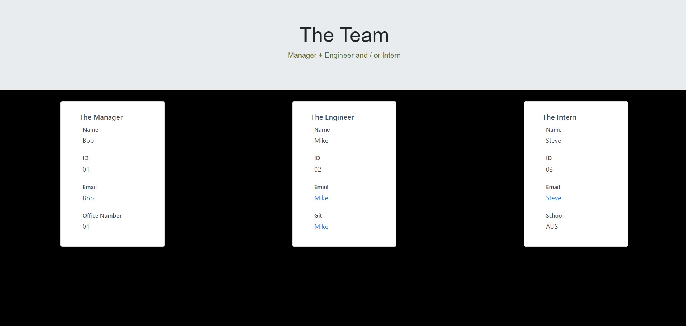

# Team Generator

## Video Walkthrough
https://youtu.be/wH3vdVmGd40

## Summary
Node.js Team Generator

## Description 
Use the app to build a team profile using Node.js.

Following a series of prompts to input data, generate a team is consisting of a Manager plus an Engineer and/or Intern. 

Name, ID, and email is prompted for each member. 

Additional data: Office Number for Manager, Github for Engineer, School for Intern.

Corresponding links for emails and Github are generated. 

App output is html. 

## Instructions

### Testing
From root, go to 'tests' folder and open 'Employee.test.js' (or any .test file)

Open Node.js via integrated terminal. Run npm test to verify functions. 

You can also run npm test directly from the index.js file. 

### Running 
From root, run index.js.

Open Node.js via integrated terminal. Run node index. 

Follow prompts to generate profiles. 

An html output will be generated in the root folder. 

## Contact
grimdango@gmail.com

## Log 
### 15/02/22
Final upload, readme added, index.js comments

### 12/02/22
Updating

### 11/02/22
First upload - base code and partial working code

   

